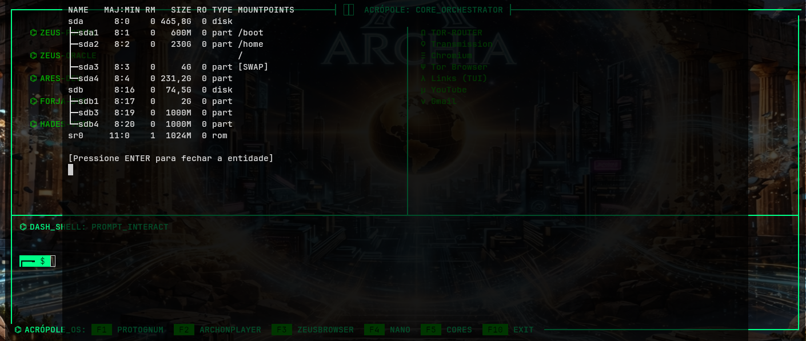
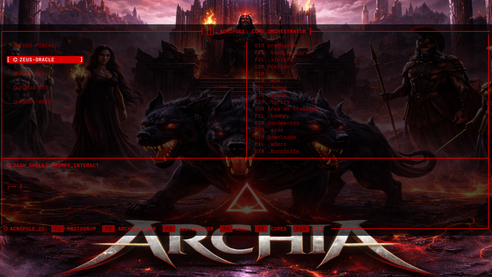
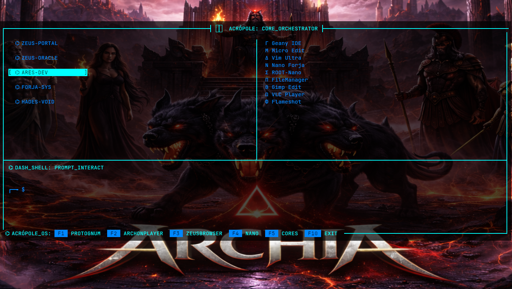
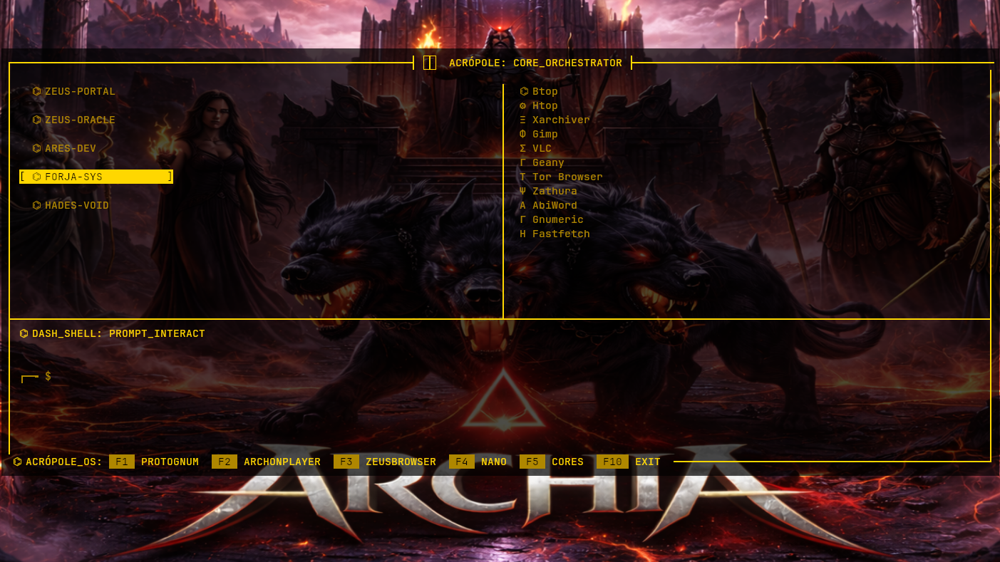

# ⌬ ACRÓPOLE OS ─ [CORE ORCHESTRATOR]
> **Central Operacional Alpha Node** • *Gerenciador Multiprocessos & Sincronização do Ecossistema Archon*

---

## 📸 INTERFACE DO SISTEMA


### ⌬ Monitoramento de Redes (Módulo Atlas)


### ⌬ Perfis Cromáticos (Matrizes de Divindades)
<p align="center">
  
  
  
</p>
---

## ⚔️ O ARSENAL TECNOLÓGICO

O **Acrópole OS** é o coração computacional definitivo do ecossistema Archon. Desenvolvido puramente em **Linguagem C** e arquitetado sobre a biblioteca `ncurses`, ele atua como um gerenciador de subprocessos de baixo nível. Sua função é unificar, monitorar e disparar todos os TUIs do sistema através de uma única interface de alto desempenho, otimizada para o consumo mínimo de memória RAM e CPU.

### 🛠️ Arquitetura de Módulos (Mitologia Digital)

A matéria-prima do sistema foi dividida cirurgicamente em componentes especializados, batizados em homenagem às divindades e titãs que governam cada fluxo de dados:

*   🪽 **Hermes (`src/launcher/hermes.c`):** O mensageiro do Olimpo. Responsável pelo gerenciamento de `fork()` e `exec()`, isolando e disparando os terminais filhos sem bloquear a matriz principal.
*   💀 **Lethe (`src/clean/lethe.c`):** O rio do esquecimento. Camada tática responsável pela captura de sinais (`SIGCHLD`), encerramento seguro e limpeza de processos zumbis na memória.
*   🌍 **Atlas (`src/monitor/atlas.c`):** O titã que sustenta o mundo. Painel de monitoramento em tempo real responsável por ler e renderizar fluxos de rede, conexões e métricas do sistema.
*   🛡️ **Athena & Zeus (`src/logic/`):** A inteligência estratégica. Controla as regras de negócio, a troca de contextos cromáticos (Matrizes) e o ecossistema de submenus do console.

---

## 🎹 MATRIZ DE COMANDOS (KEYBINDINGS GLOBAL)

O painel inferior do orquestrador fornece salto tático instantâneo para qualquer utilitário do sistema operacional:


| Tecla | Módulo Residente | Operação de Núcleo |
| :---: | :--- | :--- |
| <kbd>F1</kbd> | 📁 **PROTOGNUM** | Invoca o gerenciador de arquivos em C com otimização de shell |
| <kbd>F2</kbd> | 🎵 **ARCHONPLAYER** | Ativa o player de áudio digital para streams e arquivos locais |
| <kbd>F3</kbd> | 🌐 **ZEUS-BROWSER** | Dispara o radar de busca e navegação TUI integrado via Feh |
| <kbd>F4</kbd> | 📝 **NANO** | Abre o editor de texto para manipulação rápida de scripts e logs |
| <kbd>F5</kbd> | 🧠 **CORES** | Alterna os perfis e esquemas cromáticos da Acrópole |
| <kbd>F10</kbd>| ❌ **EXIT** | Desativação segura do ecossistema, limpando a memória RAM |

---
## 🛠️ ARQUITETURA DE INSTALAÇÃO (O RITUAL)

A forja do Acrópole OS possui um motor inteligente em seu `Makefile`. Ao iniciar a compilação, o sistema verifica a presença de todos os outros aplicativos do ecossistema e compila em cascata qualquer ferramenta ausente de forma automatizada.

Antes de iniciar a compilação, garanta que as ferramentas base de build e as bibliotecas gráficas estão prontas no sistema de arquivos:

### 1. Dependências do Sistema (Arsenal Completo de Divindades)
```bash
sudo pacman -S --needed \
    ncurses feh alsa-utils sdl2 sdl2_mixer networkmanager udisks2 polkit qterminal nsxiv base-devel git make gcc \
    tor torbrowser-launcher transmission-gtk chromium links \
    lxappearance gparted \
    geany kitty micro vim pcmanfm gimp vlc flameshot \
    bmon glances mtr httping btop htop xarchiver zathura abiword gnumeric fastfetch
```


### 2. Invocação e Compilação Global
```bash
# Clone a central do Orquestrador
git clone https://github.com/luiskallak-design/acropole
cd acropole

# Compila o Acrópole e puxa toda a cambada ausente de forma automática
make

# Move o binário central e vincula os caminhos globais do sistema
sudo make install
```

---

## ⚡ OTIMIZAÇÃO TÁTICA PARA NOTEBOOKS / HARDWARE LIMITADO

Para evitar gargalos no processamento do terminal do seu notebook e garantir o menor consumo possível de recursos do hardware, inicialize a central do sistema operacional substituindo nativamente o processo do shell pai através do comando `exec`:

```bash
exec acropole
```

### Vínculo Permanente (Recomendado)
Para automatizar o carregamento e garantir o fechamento limpo da janela ao pressionar <kbd>F10</kbd>, adicione este alias fixo ao seu arquivo de configuração (`~/.bashrc` ou `~/.zshrc`):

```bash
alias acropole='exec /usr/local/bin/acropole'
```

---

## 📂 ORGANIZAÇÃO DA MATÉRIA-PRIMA

```text
acropole/
├── assets/         # Temas visuais e identidades cromáticas do sistema (.png)
├── build/          # Objetos (.o) e dependências de compilação (.d)
├── include/        # Cabeçalhos e definições estruturais (.h)
├── src/            # Código-fonte puro dividido por divindades
│   ├── clean/      # Coletor de processos e zumbis (Lethe)
│   ├── launcher/   # Disparador de subprocessos e terminais (Hermes)
│   ├── logic/      # Regras de negócio e interface interna (Athena/Zeus)
│   ├── monitor/    # Renderização e leitura de dados de rede (Atlas)
│   └── main.c      # Ponto de entrada do sistema
├── Makefile        # Instruções de compilação e clonagem em cascata
└── PKGBUILD        # Script de empacotamento oficial para o Arch Linux
```

---
**[⌬] STATUS:** *Matriz Operacional Online • Monitor Atlas ativo • Aguardando comandos.*
<!-- TAGS: archlinux terminal tui c-programming low-level sysadmin hacking aesthetic archon acropole-os -->
